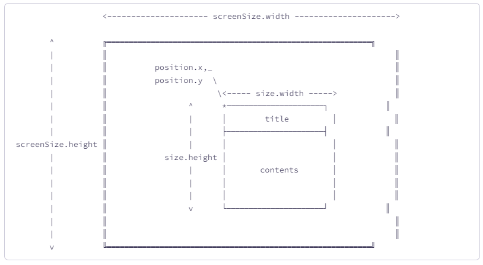

# Instructions

In this exercise, you will be simulating a windowing based computer system. You will create some windows that can be moved and resized. The following image is representative of the values you will be working with below.




📣To practice your wide range of JavaScript skills, try to solve tasks 1 and 2 with prototype syntax and the remaining tasks with class syntax.

## Task 1 Define Size for storing the dimensions of the window

Define a class (constructor function) named `Size`. It should have two fields `width` and `height` that store the window's current dimensions. The constructor function should accept initial values for these fields. The width is provided as the first parameter, the height as the second one. The default width and height should be `80` and `60`, respectively.

Additionally, define a method `resize(newWidth, newHeight)` that takes a new width and height as parameters and changes the fields to reflect the new size.
```js
const size = new Size(1080, 764);
size.width;
// => 1080
size.height;
// => 764

size.resize(1920, 1080);
size.width;
// => 1920
size.height;
// => 1080
```
## Task 2 Define Position to store a window position

Define a class (constructor function) named `Position` with two fields, `x` and `y` that store the current horizontal and vertical position, respectively, of the window's upper left corner. The constructor function should accept initial values for these fields. The value for `x` is provided as the first parameter, the value for `y` as the second one. The default value should be `0` for both fields.

The position (0, 0) is the upper left corner of the screen with `x` values getting larger as you move right and `y` values getting larger as you move down.

Also define a method `move(newX, newY)` that takes new x and y parameters and changes the properties to reflect the new position.
```js
const point = new Position();
point.x;
// => 0
point.y;
// => 0

point.move(100, 200);
point.x;
// => 100
point.y;
// => 200
```
## Task 3 Define a ProgramWindow class

Define a `ProgramWindow` class with the following fields:

- `screenSize`: holds a fixed value of type `Size` with `width` 800 and `height` 600
- `size` : holds a value of type Size, the initial value is the default value of the Size instance
- `position` : holds a value of type Position, the initial value is the default value of the Position instance
When the window is opened (created), it always has the default size and position in the beginning.
```js
const programWindow = new ProgramWindow();
programWindow.screenSize.width;
// => 800

// Similar for the other fields.
```
Side note: The name `ProgramWindow` is used instead of `Window` to differentiate the class from the built-in `Window` class that exists in browser environments.

## Task 4 Add a method to resize the window

The `ProgramWindow` class should include a method `resize`. It should accept a parameter of type `Size` as input and attempts to resize the window to the specified size.

However, the new size cannot exceed certain bounds.

- The minimum allowed height or width is 1. Requested heights or widths less than 1 will be clipped to 1.
- The maximum height and width depend on the current position of the window, the edges of the window cannot move past the edges of the screen. Values larger than these bounds will be clipped to the largest size they can take. E.g. if the window's position is at `x` = 400, `y` = 300 and a resize to `height` = 400, `width` = 300 is requested, then the window would be resized to `height` = 300, `width` = 300 as the screen is not large enough in the `y` direction to fully accommodate the request.
```js
const programWindow = new ProgramWindow();

const newSize = new Size(600, 400);
programWindow.resize(newSize);
programWindow.size.width;
// => 600
programWindow.size.height;
// => 400
```

## Task 5 Add a method to move the window

Besides the resize functionality, the `ProgramWindow` class should also include a method `move`. It should accept a parameter of type `Position` as input. The `move` method is similar to `resize` however, this method adjusts the position of the window to the requested value, rather than the size.

As with `resize` the new position cannot exceed certain limits.

- The smallest position is 0 for both `x` and `y`.
- The maximum position in either direction depends on the current size of the window. The edges cannot move past the edges of the screen. Values larger than these bounds will be clipped to the largest size they can take. E.g. if the window's size is at `x` = 250, `y` = 100 and a move to `x` = 600, `y` = 200 is requested, then the window would be moved to `x` = 550, `y` = 200 as the screen is not large enough in the `x` direction to fully accommodate the request.
```js
const programWindow = new ProgramWindow();

const newPosition = new Position(50, 100);
programWindow.move(newPosition);
programWindow.position.x;
// => 50
programWindow.position.y;
// => 100
```

## Task 6 Change a program window

Implement a `changeWindow` function that accepts a `ProgramWindow` instance as input and changes the window to the specified size and position. The function should return the `ProgramWindow` instance that was passed in after the changes were applied.

The window should get a width of 400, a height of 300 and be positioned at x = 100, y = 150.
```js
const programWindow = new ProgramWindow();
changeWindow(programWindow);
programWindow.size.width;
// => 400

// Similar for the other fields.
```